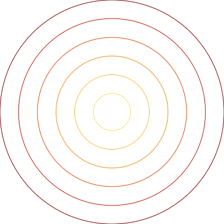
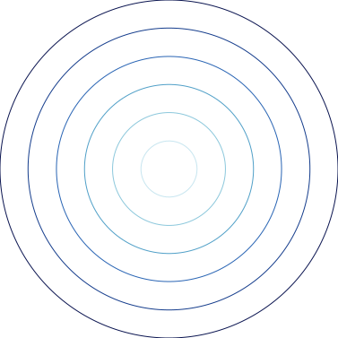
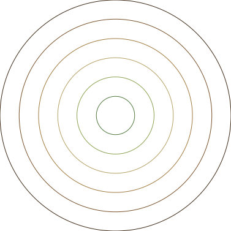
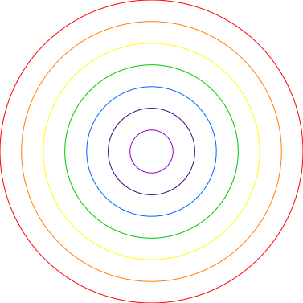
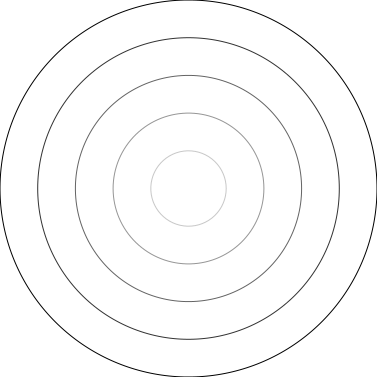
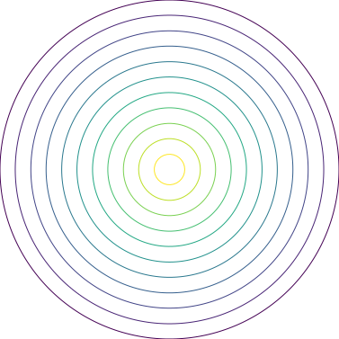
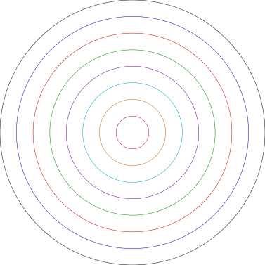

# vpype-penset

Pen set infrastructure for [vpype](https://github.com/abey79/vpype) plotter plugins. Provides predefined pen sets and pipeline commands for applying pen colors and widths to multi-layer plotter output.


## Installation

```bash
pip install vpype-penset
```

Or inject it into an existing `vpype` installation:

```bash
pipx inject vpype vpype-penset
```

For development:

```bash
pip install -e ".[dev]"
```

## Usage

### Set pen set upstream, apply downstream

Colorize assigns pens to layers in order: layer 1 gets pen 1, layer 2 gets pen 2, etc.
Use `-l` on geometry commands to target a specific pen from the set.

```bash
# Draw concentric circles with pens 1, 2, and 3 from the warm palette
vpype penset warm circle -l 1 0 0 5cm circle -l 2 0 0 4cm circle -l 3 0 0 3cm colorize write out.svg

# Skip pen 2 — only use pens 1 and 3
vpype penset warm circle -l 1 0 0 5cm circle -l 3 0 0 3cm colorize write out.svg
```



### Override pen set at colorize

```bash
vpype circle -l 1 0 0 3cm circle -l 2 0 0 2cm circle -l 3 0 0 1cm colorize --penset cool write out.svg
```

### Custom hex colors

```bash
vpype penset "#ff0000,#00ff00,#0000ff" ... colorize write out.svg
```

### Load from a TOML file

```bash
vpype penset my-pens.toml ... colorize write out.svg
```

## Available Pen Sets

### Artistic

| | Name | Pens | Description |
|---|------|------|-------------|
|  | `warm` | 6 | Warm reds, oranges, yellows |
|  | `cool` | 6 | Cool blues and teals |
|  | `earth` | 6 | Earth tones |
|  | `rainbow` | 7 | Full spectrum ROYGBIV |
|  | `grayscale` | 5 | Black to light gray |
|  | `viridis` | 11 | Perceptually uniform (matplotlib-style) |

### Plotter Pens

| | Name | Pens | Description |
|---|------|------|-------------|
|  | `stabilo88` | 8 | Stabilo Point 88 pen colors (0.4mm) |
|  | `staedtler` | 8 | Staedtler Triplus pen colors (0.3mm) |
|  | `pilot_g2` | 8 | Pilot G-2 0.5 roller ink pen colors |
| | `pigma` | 8 | Sakura Pigma Micron colors (0.45mm / size 05) |
| | `pigma_sizes` | 6 | Sakura Pigma Micron black in 6 tip sizes (005-08) |
| | `copic` | 12 | Copic marker representative set (fine tip 0.5mm) |

## Commands

### `penset`

Sets the active pen set for downstream commands. Accepts a built-in name, comma-separated hex colors (with optional pen width), or a TOML file path.

```bash
vpype penset warm ...              # Built-in pen set
vpype penset "#f00,#0f0" ...       # Custom hex colors
vpype penset "#f00:0.7,#0f0:0.5"  # Hex colors with pen widths
vpype penset my-pens.toml ...      # TOML file
```

### `colorize`

Applies the active pen set to document layers, assigning `vp_color` (and `vp_pen_width` when defined) to each layer.

```bash
vpype penset warm circle -l 1 0 0 5cm circle -l 2 0 0 4cm circle -l 3 0 0 3cm colorize write out.svg
vpype circle -l 1 0 0 3cm circle -l 2 0 0 2cm colorize --penset cool write out.svg
vpype penset warm circle -l 1 0 0 5cm circle -l 2 0 0 3cm colorize --reverse write out.svg
```

### `pensets`

Lists all available built-in pen sets with their colors:

```bash
vpype pensets
```

### `peninfo`

Prints the active pen set in a compact table for quick inspection:

```bash
vpype penset stabilo88 peninfo
vpype peninfo --penset pilot_g2
```

## TOML Pen Set Format

A pen set file defines pens with a color, optional tip width (mm), and optional name:

```toml
[penset]
name = "my-pens"      # optional — defaults to the filename

[[penset.pens]]
color = "#000000"      # required — hex color (#RRGGBB or #RGB)
width = 0.7            # optional — tip width in mm
name = "Black 0.7"     # optional — human-readable label

[[penset.pens]]
color = "#0000ff"
width = 0.5
name = "Blue 0.5"

[[penset.pens]]
color = "#ff0000"
```

The `[penset]` table is required. Each `[[penset.pens]]` entry must have a `color`
field; `width` and `name` are optional. When `colorize` applies a pen set, layers
receive both `vp_color` and (if present) `vp_pen_width` properties.

## API for Plugin Developers

vpype-penset provides the palette data model and built-in pen sets. Generators
do **not** need to import or depend on vpype-penset directly. Instead, the
recommended integration pattern uses `penassign` (from vpype-linemod) as the
sole interface between generators and pen/palette selection:

```
generator -> layers -> penassign -> colorize -> write
```

1. **Generators** produce geometry on numbered layers (using `-l`/`--layer`).
2. **`penassign`** (vpype-linemod) maps layers to pens from the active palette.
3. **`colorize`** (vpype-penset) applies pen colors and widths to layers.

### Data model exports

If you are building tooling that works with pen sets programmatically:

```python
from vpype_penset import PenSet, Pen, PEN_SETS, load_penset

# Access a built-in pen set
ps = PEN_SETS["stabilo88"]

# Sample colors for N layers (cycles if N > pen set size)
colors = ps.sample_colors(num_layers)

# Interpolate a gradient
gradient = ps.interpolate(12)

# Load a custom pen set from TOML
custom = load_penset("my-pens.toml")
```

### Pipeline metadata

Pen sets flow through the pipeline via `doc.metadata["vpype_penset.active"]`.
The `store_penset()` and `resolve_penset()` helpers manage this metadata, but
most plugins should not need to call them directly -- the `penset` and
`colorize` CLI commands handle the pipeline flow.

## License

MIT
